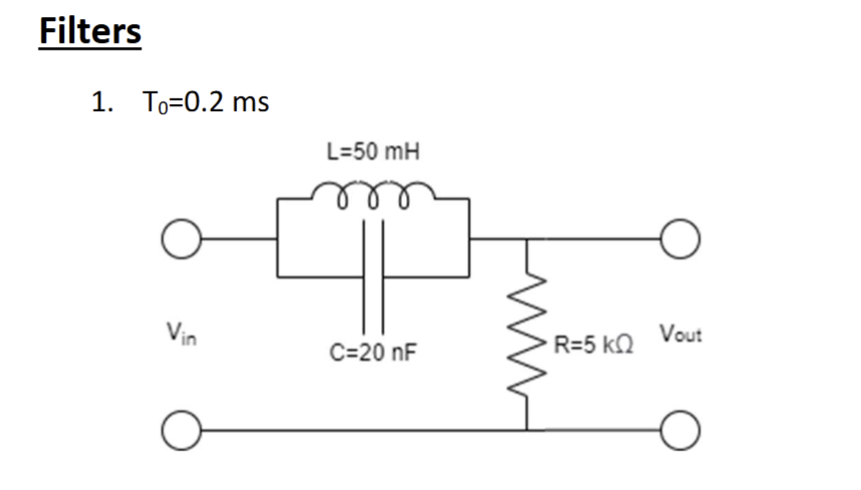

# TRANSFORM-METHODS
Analysis and simulation of a 2nd-order analog filter using Fourier/Laplace methods: derive  𝐻 ( 𝑠 ) H(s), step response, Bode plots, square-wave response, and validate against circuit simulation.

I analyze a linear second-order analog filter using Fourier and Laplace transforms: derive the transfer function 
𝐻
(
𝑠
)
, compute the closed-form step response and verify it numerically, generate Bode magnitude/phase plots, and evaluate the square-wave response via the first five Fourier harmonics. Results are validated against circuit simulation in LTspice. Code is in Python (scipy.signal, matplotlib).

