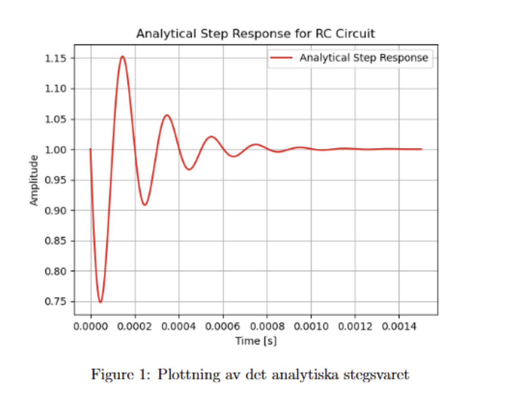
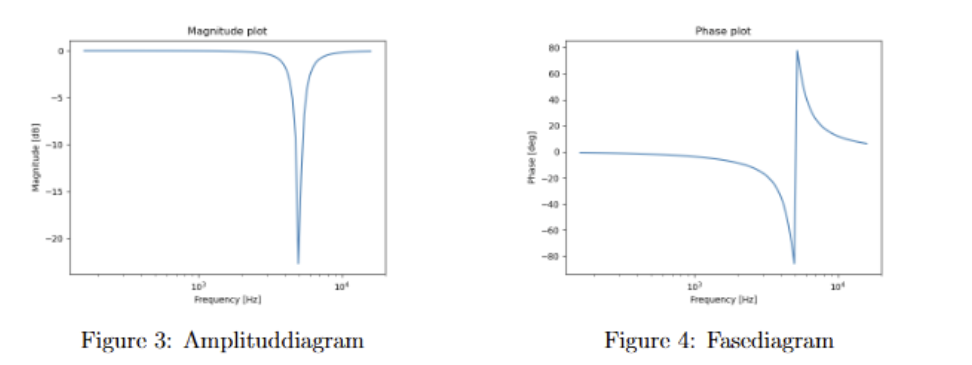

## Härledning av filteröverföringsfunktionen

I detta avsnitt härleds överföringsfunktionen mellan in- och utspänningsnivåerna i kretsen genom att använda impedansmetoden i Laplace-domänen.

### 2 Härledning med impedansmetoden
Överföringsfunktionen $H(s)\$ kan uttryckas som:

$$
\frac{V_{\text{out}}}{V_{\text{in}}} = \frac{s^{2} C L R + R}{s^{2} C L R + Ls + R}
$$

Härleddes för hand. 

Derive the analytical expression for the step response of your filter in time domain.
b. Plot the function you obtained in (a) using a plotting library of your choice.
c. Verify your analytical calculation in the previous part by comparing with the
numerical solution obtained by a reliable library/toolbox.

### 3 Step respons

härledning av analytical expression for the step response of your filter in time domain.

Through partial fraction division and some inbetween stpes we ended at the inverse Lapalce function of 

$$
\mathcal{L}^{-1}\{Y(s)\}(t) 
= 1 - e^{-5000t} \cdot \frac{1}{RC\beta} \, \sin(\beta t),
$$

step respons: 

$$
y(t) = 1 - e^{-5000t}  0.32035 \sin\big(\sqrt{975000000}\  t\big)
$$

## 4 Amplitud- och fasediagram (Bode-diagram)

Nedan visas amplitud- och fasediagram för filtret som funktion av inmatningsfrekvensen.  
Vid en visuell inspektion kan filtertypen identifieras.

**Figur 3:** Amplituddiagram  
**Figur 4:** Fasediagram  

Utifrån Bode-diagrammet kan filtret klassificeras som ett **notch-filter**, då det dämpar signalen vid *5 kHz*.

