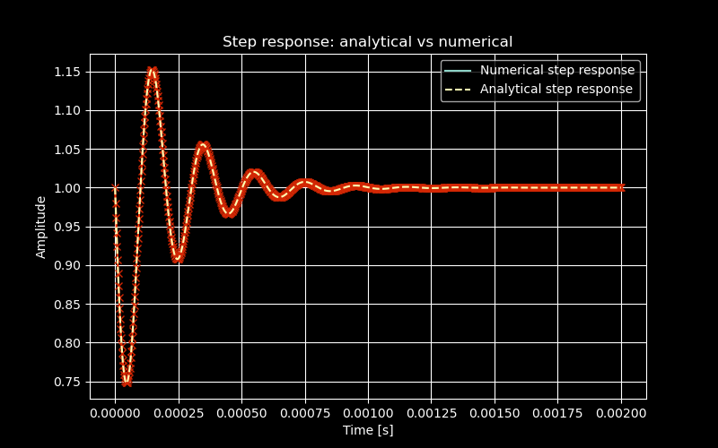

## 2 Derivation of the filter transfer function

In this section, the transfer function between input and output voltage levels in the circuit is derived using the impedance method in the Laplace domain.

### 2.1 Derivation using the impedance method

The transfer function $H(s)$ can be expressed as:

$$
\frac{V_{\text{out}}}{V_{\text{in}}} = \frac{s^{2} C L R + R}{s^{2} C L R + Ls + R}
$$

Derived by hand.  

a. Derive the analytical expression for the step response of your filter in the time domain.  
b. Plot the function you obtained in (a) using Python.  

## 3 Step response

Derivation of the analytical expression for the step response of the filter in the time domain.

Through partial fraction expansion and some intermediate steps, we obtained the inverse Laplace transform:

$$
\mathcal{L}^{-1}\{Y(s)\}(t) 
= 1 - e^{-5000t} \cdot \frac{1}{RC\beta} \, \sin(\beta t)
$$

Step response: 

$$
y(t) = 1 - e^{-5000t} \, 0.32035 \, \sin\big(\sqrt{975000000}\, t\big)
$$

## 4 Amplitude and phase diagrams (Bode diagram)

Below the amplitude and phase diagrams for the filter are shown as functions of the input frequency.  
By visual inspection, the filter type can be identified.

**Figure 3:** Amplitude diagram  
**Figure 4:** Phase diagram  

From the Bode diagram, the filter can be classified as a **notch filter**, since it attenuates the signal at *5 kHz*.

## 5 Square wave input

A periodic square wave between $0 \, \text{V}$ and $1 \, \text{V}$ with a period of $T_0$ is considered.  
This signal can be expressed using its Fourier series expansion.

### 5.1 Fourier series expansion of the square wave

The square wave between $0 \, \text{V}$ and $1 \, \text{V}$ has a Fourier series given by:

$$
x(t) = \frac{1}{2} + \frac{2}{\pi} \sum_{k=0}^{\infty} \frac{1}{2k+1} \sin\big((2k+1)\omega_0 t\big)
$$

where $T_0$ is the period of the signal and $k$ are integers $(1, 2, 3, \ldots)$.

The sum of the first four nonzero terms in the Fourier series:  

